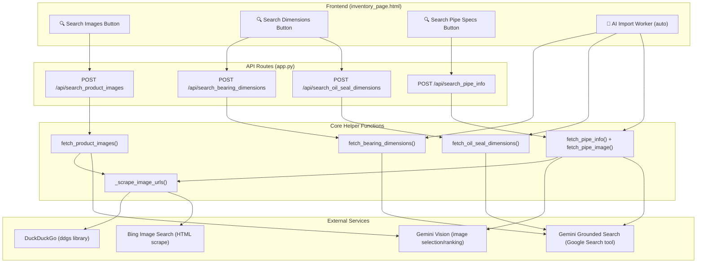
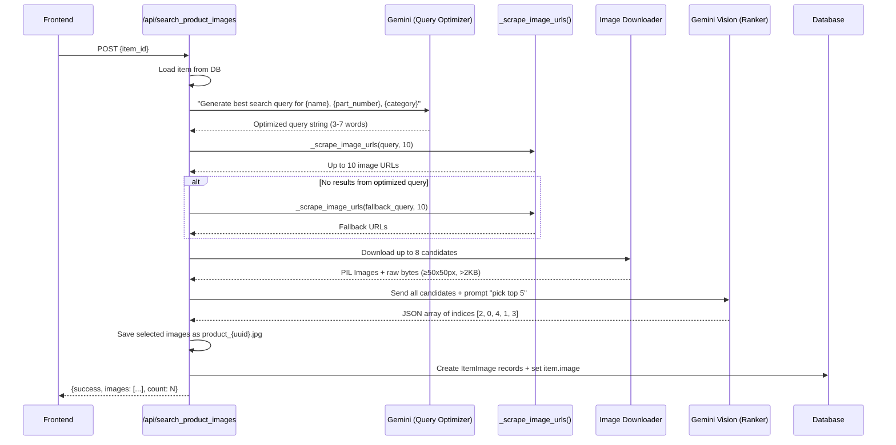
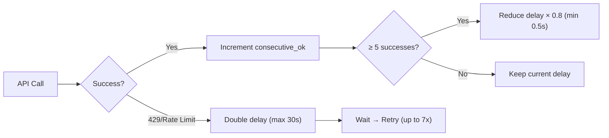

# Image Online Searching — Complete Logic Layout

## System Architecture Overview



---

## 1. Image Scraping Engine — [_scrape_image_urls()](file:///c:/Users/user%201/Downloads/Projects/NAZ%20Import%20Inventory/app.py#1608-1698)

> [app.py:1608-1697](file:///c:/Users/user%201/Downloads/Projects/NAZ%20Import%20Inventory/app.py#L1608-L1697)

The core function that finds image URLs on the web. Uses a **two-strategy fallback** approach — no API keys needed.

### Strategy 1: DuckDuckGo (`ddgs` library) — Primary

```
Query → ddgs.images() → filter (.svg, .gif, duplicates) → return URLs
```

- Uses the `ddgs` pip package (listed in [requirements.txt](file:///c:/Users/user%201/Downloads/Projects/NAZ%20Import%20Inventory/requirements.txt))
- Retries up to **2 times** with 1s delay on "No results" errors
- Filters out `.svg` and `.gif` files, deduplicates by URL
- Returns up to `num_results` image URLs

### Strategy 2: Bing HTML Scrape — Fallback

```
Query → Bing.com homepage (cookies) → Bing Images search → regex extraction → return URLs
```

Only reached if DDG fails. Three regex patterns tried in order:

| Pattern | Regex | Purpose |
|---------|-------|---------|
| `murl&quot;` | `murl&quot;:&quot;(https?://[^&]+)` | Full-res image URLs from Bing's JSON-like markup |
| `murl` alternate | `murl[&"][:=][&"]?(https?://[^"&\s]+)` | Alternative murl attribute format |
| `mediaurl` | `mediaurl=(https?://[^&"]+)` | Legacy URL parameter format |

- Sets real Chrome User-Agent headers
- Visits `bing.com/` first to collect cookies
- URL-decodes and deduplicates results

---

## 2. Product Image Search — [fetch_product_images()](file:///c:/Users/user%201/Downloads/Projects/NAZ%20Import%20Inventory/app.py#1806-1988)

> [app.py:1806-1987](file:///c:/Users/user%201/Downloads/Projects/NAZ%20Import%20Inventory/app.py#L1806-L1987)

The **main universal image search** function. Fetches up to **5 product images** with AI-powered query optimization and AI-powered image ranking.

### Flow Diagram



### Step-by-Step Logic

| Step | Action | Details |
|------|--------|---------|
| **1. Query Generation** | Gemini AI generates the optimal search query | Prompt includes item name, part number, description, category. Rules: always include part number, keep to 3-7 words, translate non-English |
| **1b. Fallback Query** | If AI query is invalid (< 3 or > 80 chars) | Falls back to `"{part_number} {item_name}"` concatenation |
| **2. Image Scraping** | [_scrape_image_urls(query, 10)](file:///c:/Users/user%201/Downloads/Projects/NAZ%20Import%20Inventory/app.py#1608-1698) | Tries DDG → Bing to get up to 10 URLs |
| **2b. Auto-Fallback** | If AI-optimized query returns 0 results | Automatically retries with simple `part_number + item_name` query |
| **3. Download** | HTTP GET each URL (timeout 5s) | Filters: status 200, size > 2KB, dimensions ≥ 50×50, converts to RGB. Stops at 10 valid candidates |
| **4. AI Ranking** | Gemini Vision reviews all candidates | Sends JPEG images with prompt asking to pick top 5. **Lenient** criteria: watermarks OK, busy backgrounds OK, packaging OK. Only rejects completely unrelated images |
| **5. Save** | Write selected images to `static/uploads/` | Filenames: `product_{uuid8}.jpg`. If AI indices are invalid, falls back to first 5 candidates |
| **6. AI Failure Fallback** | If Gemini Vision call fails entirely | Saves first 5 downloaded candidates without AI validation |

### Frontend Trigger — `searchProductImages()` 

> [inventory_page.html:1589-1666](file:///c:/Users/user%201/Downloads/Projects/NAZ%20Import%20Inventory/templates/inventory_page.html#L1589-L1666)

- Button in the Edit Item modal
- Shows loading spinner → posts `{item_id}` → appends returned images to gallery
- 2-second success/failure message before resetting button state

---

## 3. Pipe Image Search — `fetch_pipe_image()`

> [app.py:1700-1804](file:///c:/Users/user%201/Downloads/Projects/NAZ%20Import%20Inventory/app.py#L1700-L1804)

Fetches a **single best** pipe/exhaust image with brand-aware queries.

### Logic

```
1. Brand detection by part number prefix:
   - "894" / "8-94" / "897" → Isuzu
   - "174" / 10-digit numeric → Toyota

2. Query: "{brand} {part_number} exhaust pipe"

3. Scrape → Download up to 5 candidates (≥50x50, >2KB)

4. Gemini Vision selection:
   - Prompt: "pick the BEST exhaust pipe image"
   - Criteria: pipe part only (no packaging), clean background
   - Returns single index (0-4) or -1 if none suitable

5. Save as pipe_{uuid}.jpg
```

### Called By
- Route: `POST /api/search_pipe_info` (alongside `fetch_pipe_info()`)
- AI Import Worker: `process_single_page_pipe()` during PDF imports

---

## 4. Bearing Dimension Lookup — `fetch_bearing_dimensions()`

> [app.py:1234-1292](file:///c:/Users/user%201/Downloads/Projects/NAZ%20Import%20Inventory/app.py#L1234-L1292)

Uses **Gemini Grounded Search** (Gemini with Google Search tool) — no scraping needed.

```
Input: bearing_code (e.g. "6203-2RS")
↓
Gemini + GoogleSearch tool: "Find dimensions of bearing {code}"
↓
AI returns: {"inner_diameter": 17, "outer_diameter": 40, "width": 12}
↓
Parse JSON → update InventoryItem.inner/outer/width → set web_searched = True
```

- Uses `genai_types.Tool(google_search=genai_types.GoogleSearch())` config
- Built-in retry with exponential backoff (via `_gemini_generate`)
- Returns `None` if dimensions not found

### Called By
- Route `POST /api/search_bearing_dimensions`
- AI Import Workers (parallel enrichment after PDF/Excel import via ThreadPoolExecutor, 5 workers)

---

## 5. Oil Seal Dimension Lookup — `fetch_oil_seal_dimensions()`

> [app.py:1547-1603](file:///c:/Users/user%201/Downloads/Projects/NAZ%20Import%20Inventory/app.py#L1547-L1603)

**Identical pattern** to `fetch_bearing_dimensions()` but with oil-seal-specific prompts.

```
Prompt: "Find dimensions of oil seal {code}"
Search term: "{code} oil seal dimensions" or "{code} oil seal size"
Returns: {"inner_diameter": X, "outer_diameter": Y, "width": Z}
```

---

## 6. Pipe Info Lookup — `fetch_pipe_info()`

> [app.py:1989-2050](file:///c:/Users/user%201/Downloads/Projects/NAZ%20Import%20Inventory/app.py#L1989-L2050)

Uses **Gemini Grounded Search** to find pipe metadata (not images).

```
Input: part_number
↓  
Gemini + GoogleSearch: "Find specs for exhaust pipe {part_number}"
↓
Returns: {"brand": "Isuzu", "vehicle_model": "NKR 4JB1", "description": "..."}
```

> [!NOTE]
> The `/api/search_pipe_info` route calls **both** `fetch_pipe_info()` (for metadata) and `fetch_pipe_image()` (for the product photo) in sequence.

---

## Rate Limiting & Resilience

### Adaptive Rate Limiter



| Parameter | Value |
|-----------|-------|
| Initial delay | 1.0s |
| Min delay | 0.5s |
| Max delay | 30.0s |
| Backoff multiplier | × 2 on failure, × 0.8 on 5 consecutive successes |
| Max retries (Gemini) | 7 |
| Max retries (Claude) | 5 |
| Retry base wait | 15s, doubling up to 300s |

---

## Dependencies

| Package | Purpose |
|---------|---------|
| `ddgs` | DuckDuckGo image search (primary) |
| `requests` | HTTP client for Bing scraping & image download |
| `beautifulsoup4` | Listed but not currently used by image search (available for future) |
| `google-genai` | Gemini API (grounded search + vision) |
| `anthropic` | Claude API (used for PDF crop detection, not image search) |
| `Pillow` | Image validation, conversion, cropping |

---

## Data Flow Summary

| Trigger | Route | What Gets Fetched | What Gets Saved |
|---------|-------|-------------------|-----------------|
| "Search Images" button (any category) | `/api/search_product_images` | Up to 5 product photos from web | `ItemImage` records + `item.image` |
| "Search Dimensions" button (bearing) | `/api/search_bearing_dimensions` | inner/outer diameter + width | `InventoryItem` dimension fields + `web_searched=True` |
| "Search Dimensions" button (oil seal) | `/api/search_oil_seal_dimensions` | inner/outer diameter + width | Same as above |
| "Search Specs Online" button (pipe) | `/api/search_pipe_info` | brand, vehicle model, description + 1 image | `InventoryItem` metadata + `ItemImage` + `web_searched=True` |
| AI PDF/Excel Import (bearing) | Parallel ThreadPoolExecutor | Dimensions for all imported items | Bulk dimension updates |
| AI PDF Import (pipe) | `process_single_page_pipe()` | 1 image per pipe part | `ItemImage` records |
